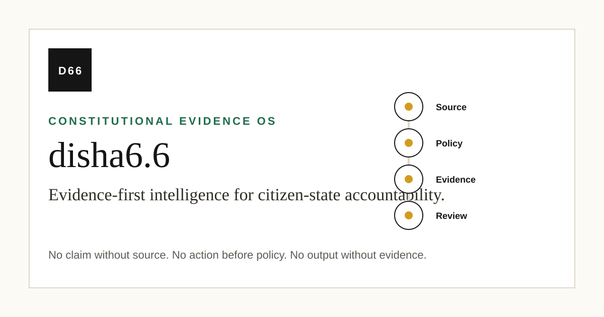
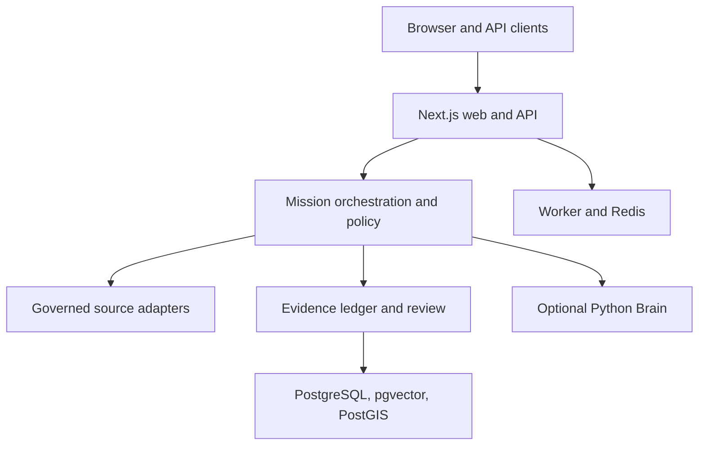

<div align="center">



# disha6.6

**An evidence-first workspace for governed public-source intelligence and reviewable AI.**

A Next.js product and bounded Python research service that connect source observations, policy decisions, evidence events, and human review.

[](https://github.com/Tashima-Tarsh/Disha6.6/actions/workflows/ci.yml)
[](https://github.com/Tashima-Tarsh/Disha6.6/actions/workflows/db-migrations.yml)
[](https://github.com/Tashima-Tarsh/Disha6.6/actions/workflows/codeql.yml)


[Overview](#overview) · [Architecture](#architecture) · [Capabilities](#capabilities) · [Run locally](#run-locally) · [Documentation](#documentation) · [Security](#security-and-governance) · [Status](#status-and-limitations)

</div>

## Overview

disha6.6 is a Constitutional Evidence Operating System for analysts and teams working with public and admitted sources. It is built around a practical question: can a reviewer reconstruct how an intelligence result was produced? A mission links its inputs, source observations, policy evaluation, evidence events, and resulting report. Model output is advisory; it does not turn an unsupported assertion into a verified fact.

The default product surface is `web/`. It includes a dashboard, mission workbench, intelligence workspace, geospatial view, source and connector catalog, policy controls, and versioned API. The Python Brain in `disha/brain/` is a separate, bounded service. Catalog entries and research integrations do not imply that their upstream services are deployed or approved for execution.

**Operating chain:** source → observation → policy → evidence → review → decision.

## Architecture



The web application owns authentication, API contracts, policy decisions, and user-visible results. The database stores missions, evidence events, source records, review state, watches, and geospatial data. Scheduled work uses a separate web worker; optional Brain and embedding services are isolated. The canonical design rules and current boundaries are in [ARCHITECTURE.md](ARCHITECTURE.md).

| Layer | Implemented with | Location |
| --- | --- | --- |
| Web and API | Next.js 16, React 19, TypeScript | `web/app/`, `web/lib/` |
| Governed intelligence | Typed contracts, orchestration, policy, evidence | `web/lib/unified/` |
| Bounded research | Python Brain service | `disha/brain/` |
| Data | PostgreSQL 16, pgvector, PostGIS; optional Redis | `web/database/`, `infra/postgres/` |
| UI and maps | MapLibre, React Map GL, deck.gl | `web/components/`, `web/app/` |
| Verification | Vitest, ESLint, TypeScript, pytest, CodeQL, GitHub Actions | `web/tests/`, `tests/`, `.github/workflows/` |

## Capabilities

| Capability | What the repository implements | Operational boundary |
| --- | --- | --- |
| Mission workbench | Structured mission inputs, orchestration, policy result, evidence export | Authenticated actions; source claims need provenance |
| Evidence ledger | Ordered evidence events, hashes, retrieval and verification | Persistent production store requires `DATABASE_URL` |
| Source and OSINT catalog | Public-source registry, passive adapters, service connector metadata | Listed sources are not automatically executable |
| Intelligence workspace | Search, watches, review queue, state and change tracking | Some outputs depend on configured sources and workers |
| Geospatial command | MapLibre display and PostGIS-backed admitted geometry | Authoritative overlays require imported, admitted data |
| AI and extensions | Controlled model routes and optional Brain/extension adapters | Policy and evidence controls precede promotion into results |

The UI routes are `/login`, `/dashboard`, `/workbench`, `/intelligence`, `/surveillance`, and `/system`. [Wiki: capabilities and status](docs/wiki/Capabilities-and-Status.md) distinguishes working paths, optional services, and unfinished deployment work.

## Run locally

**Prerequisites:** Node.js 22.x and npm. Docker with Compose is needed for the database-backed stack. Python 3.11 is used by the separate Brain test workflow.

```bash
git clone https://github.com/Tashima-Tarsh/Disha6.6.git
cd Disha6.6
npm ci --prefix web
npm --prefix web run dev
```

Open <http://localhost:3000/login>. Local development can run without a database using development fallbacks; those results are not a durable production ledger. To exercise migrations and durable state, use a PostgreSQL 16 instance with pgvector and PostGIS, configure `DATABASE_URL`, then run `npm --prefix web run db:migrate` and `npm --prefix web run db:verify-schema`. See [Getting started](docs/wiki/Getting-Started.md) for environment values and the full Compose path.

```bash
npm --prefix web run lint
npm --prefix web run type-check
npm --prefix web test
npm --prefix web run build
```

The repository also defines `npm run test:python`. The CI migration workflow rehearses apply, verify, rollback, and reapply against an isolated database. Never run rollback against production without a backup and a reviewed recovery procedure.

## Repository map

| Path | Responsibility |
| --- | --- |
| `web/app/` | Screens and HTTP route handlers |
| `web/lib/server/` | Authentication, persistence, input guards, audit and server configuration |
| `web/lib/unified/` | Contracts, policy, missions, evidence, OSINT and source admission |
| `web/lib/extensions/` | Governed extension interfaces |
| `web/database/` | Versioned SQL migrations and rollback scripts |
| `disha/brain/` | Python intelligence and research service |
| `infra/postgres/` | PostgreSQL image with pgvector and PostGIS |
| `.github/workflows/` | Product, database, security, release and edge workflows |
| `docs/wiki/` | Wiki source pages maintained with the code |
| `docs/archive/`, `legacy/` | Historical material outside the default product path |

## API

The base path is `/api/v1`. Most non-health routes require authentication and an action permission. This example uses a mission schema implemented by [`web/app/api/v1/mission/route.ts`](web/app/api/v1/mission/route.ts):

```http
POST /api/v1/mission
Content-Type: application/json
Cookie: <authenticated session>

{"rawText":"Review this admitted public source","sensitivity":"public","indicators":[],"locations":[]}
```

The response is a mission result with a policy and evidence context; its precise shape depends on the requested work. Other routes include `GET /api/v1/health`, `POST /api/v1/policy/evaluate`, `GET /api/v1/evidence/{missionId}`, `POST /api/v1/evidence/export`, and `GET /api/v1/osint/search?q=example.org`. See [API and data](docs/wiki/API-and-Data.md) for access rules and storage relationships.

## Deployment and CI

The production Compose file defines a persistent PostgreSQL volume, Redis, embeddings, Brain, a one-shot `web-migrate` job, the web application, and a worker. The web service waits for successful migration. Released container images are published by [the release workflow](.github/workflows/release.yml) on version tags or manual dispatch; a source merge alone does not build new release images. Deployers must provide OIDC configuration, secrets, a persistent host, backups, TLS, and monitoring. [Operations](docs/wiki/Operations.md) describes the actual Compose and CI paths.

| Workflow | Trigger | Verification or action |
| --- | --- | --- |
| [Product CI](.github/workflows/ci.yml) | PR and `main` push | Governance, dependency audit, lint, types, tests, build |
| [Database migrations](.github/workflows/db-migrations.yml) | PR and `main` push | Isolated PostgreSQL rehearsal, Compose validation, database image build |
| [Python Core](.github/workflows/python-core.yml) | Relevant paths, manual | Brain, contracts and defensive source tests |
| [CodeQL](.github/workflows/codeql.yml) | PR, push, schedule | Static analysis |
| [Release](.github/workflows/release.yml) | Version tag, manual | Publishes web, Brain and embeddings images to GHCR |
| [Edge and smoke](.github/workflows/edge-smoke.yml) | `main` push | Tests public custom domain and login rejection |

The badge links show the **current** GitHub state. Passing CI validates code and rehearsal contracts; it does not prove that a production database has been provisioned or migrated.

## Security and governance

Non-health actions pass through authentication and policy boundaries. External data is admitted through governed sources; the product excludes private-account access, leaked credentials, and unreviewed active enumeration by default. Evidence and policy decisions must remain inspectable. See [SECURITY.md](SECURITY.md) to report a vulnerability privately, [CONTRIBUTING.md](CONTRIBUTING.md) for changes, and [the security wiki page](docs/wiki/Security-and-Governance.md) for the code boundaries.

The root package declares `UNLICENSED`; the repository does **not** grant an open source reuse license merely by being public. Review [LICENSE](LICENSE) and obtain permission before reuse or redistribution.

## Status and limitations

The Next.js application and its tests are active, and the repository includes a self-hosted PostgreSQL deployment definition. Optional services and external integrations require separate configuration. The repository does not host a database, guarantee the state of a live deployment, or include a migration of data from an older provider. Development memory fallbacks are not durable production storage. Read the [status and roadmap](docs/wiki/Capabilities-and-Status.md) before treating a catalog entry as a deployed feature.

## Documentation

- [Wiki home and navigation](docs/wiki/Home.md)
- [Architecture and request flow](docs/wiki/Architecture.md)
- [Getting started and configuration](docs/wiki/Getting-Started.md)
- [API and data model](docs/wiki/API-and-Data.md)
- [Operations and troubleshooting](docs/wiki/Operations.md)
- [Security and governance](docs/wiki/Security-and-Governance.md)
- [Capabilities and status](docs/wiki/Capabilities-and-Status.md)
- [Screenshot capture plan](docs/wiki/Screenshots.md)
- [Publish the GitHub Wiki](docs/wiki/Publishing.md)

The pages in `docs/wiki/` are versioned source for the GitHub Wiki. Changes here do not automatically publish to the separate Wiki Git repository.
