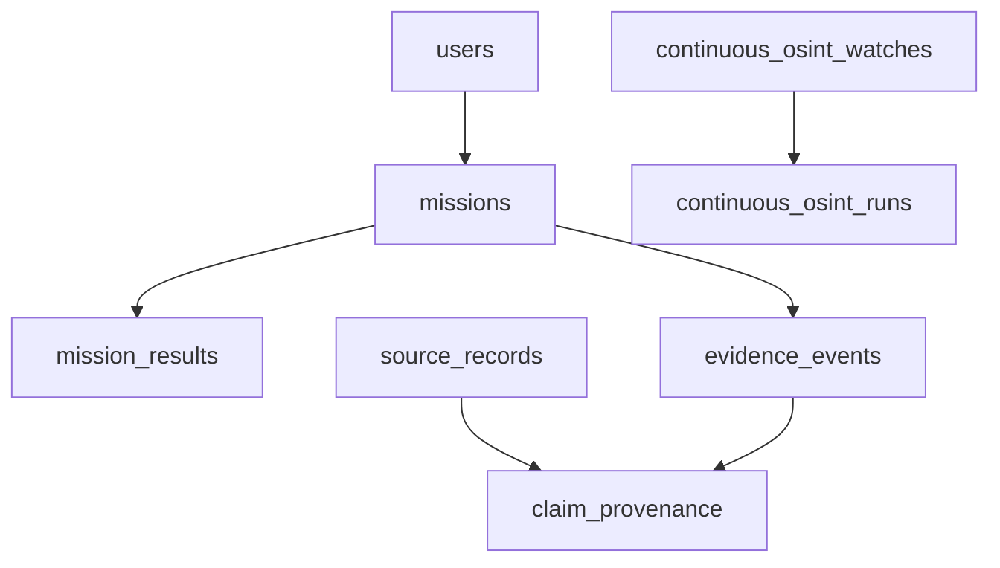

# API and data

## HTTP contract

The Next.js API is served under `/api/v1`. Health is public; most other actions use the authenticated `withContext` wrapper and permission checks. Sessions and the request ID are handled in the web runtime. The listed methods come from route implementations; the table is a selected entry point, not a generated OpenAPI specification.

| Method | Path | Purpose | Access |
| --- | --- | --- | --- |
| GET | `/api/v1/health` | Process and product capability response | Public health path |
| POST | `/api/v1/mission` | Validate and run a governed mission | `agent:run` |
| POST | `/api/v1/policy/evaluate` | Evaluate signal and lens results | `agent:run` |
| GET | `/api/v1/evidence/{missionId}` | Return events for a readable mission | `agent:read`, mission access check |
| POST | `/api/v1/evidence/export` | Export authorized mission evidence | `export`, mission access check |
| GET | `/api/v1/osint/search?q=example.org` | Query approved public adapters | `agent:read` |
| GET | `/api/v1/production/readiness` | Return runtime readiness report | `agent:read` |

Example mission body:

```json
{
  "rawText": "Review this admitted public source",
  "sensitivity": "public",
  "indicators": [],
  "locations": []
}
```

`POST /api/v1/mission` validates this body with Zod and returns the orchestrator's result. The exact result can vary by the policy decision and configured services. For an inaccessible mission evidence record, `GET /api/v1/evidence/{missionId}` returns `{"error":"Mission not found"}` with HTTP 404. Protected responses carry `X-Request-ID`; do not treat an unauthenticated example as a working request. Inspect the [route source](https://github.com/Tashima-Tarsh/Disha6.6/tree/main/web/app/api/v1/) for complete schemas.

## Persistent model

PostgreSQL migrations in `web/database/` establish the durable model. Selected relationships:



The diagram shows conceptual links; inspect the SQL for exact foreign keys and cardinality. `schema_migrations` tracks version, name, checksum and application time. The schema adds indexes for mission lookup, evidence access, source records, watches and geospatial features. Vector search uses pgvector; spatial features use PostGIS. Geospatial and continuous-watch tables have row-level security and explicit grants policy in their migrations.

## Migration safety

The one-shot `web-migrate` service runs before the web runtime in production Compose. CI uses a disposable PostgreSQL instance for rollback rehearsal. A rollback is explicitly guarded by `DISHA_CONFIRM_ROLLBACK=I_UNDERSTAND_DATA_LOSS` and can drop data; back up the persistent volume before a production change. [Operations](Operations) covers deployment and backup requirements.
