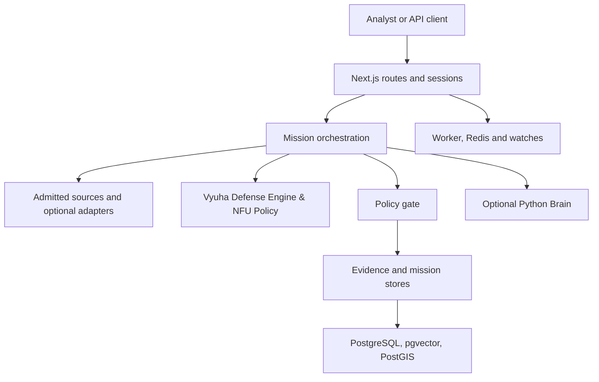

# Architecture

The default product is the TypeScript/Next.js application in `web/`. Python Brain is a separate research service. The boundary between them is a governed adapter; the Python service does not independently authorize a user-visible claim. The canonical architecture contract is [ARCHITECTURE.md](https://github.com/Tashima-Tarsh/Disha6.6/blob/main/ARCHITECTURE.md).

## Request lifecycle

1. A screen or API client submits a typed request. Route handlers validate it and obtain a principal for non-health actions.
2. Orchestration selects governed lenses and source adapters. Source output retains provenance; a registered adapter may be unavailable or blocked.
3. Policy evaluates the requested action, sensitivity, Vyuha defense formation proposals, and evidence context. Unsafe paths are denied or restricted.
4. Evidence events and mission summaries are recorded when durable storage is configured. The response can be reviewed or exported by an authorized user.
5. Scheduled work runs through the worker and persistence contracts. A failed source probe is not converted into a verified dashboard fact.

## Ownership and failure boundaries

| Boundary | Code | Constraint |
| --- | --- | --- |
| HTTP and UI | `web/app/`, `web/components/` | Authentication and validated inputs before sensitive work |
| Policy and mission logic | `web/lib/unified/` | Typed contracts, explicit decision and evidence trail |
| Vyuha Defense Engine | `skills/vyuha-defense-engine/`, `web/lib/extensions/vyuha-defense.ts` | No-First-Use defensive proposals; requires policy gate approval |
| Persistence and audit | `web/lib/server/`, `web/database/` | Production requires a durable `DATABASE_URL` |
| Background work | `web/scripts/dynamic-worker.mjs` | Internal worker token and persisted lease/workflow state |
| Brain | `disha/brain/` | Optional isolated analysis behind a governed adapter |
| Integrations | `disha/services/integrations/`, `web/lib/extensions/` | Research/upstream code needs explicit promotion into the core |

The deployment Compose file also includes embeddings and Redis; neither changes the rule that model output is advisory. Review production environment requirements in [Operations](Operations). Historical implementations under `legacy/` are outside the default web path.
