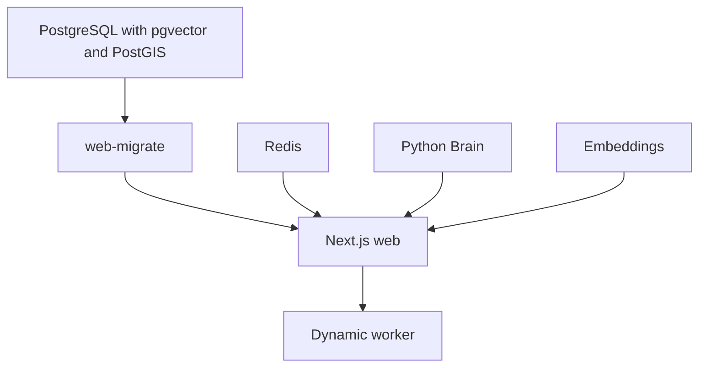

# Operations

## Production topology

The repository's production path is [`docker-compose.prod.yml`](https://github.com/Tashima-Tarsh/Disha6.6/blob/main/docker-compose.prod.yml). It defines PostgreSQL with a named `postgres_data` volume, Redis with persistent append-only storage, embeddings, Python Brain with its own data volume, the one-shot `web-migrate` job, web, and a dynamic worker. Web waits for successful migration and service health checks. GitHub Actions does **not** connect to production data.



The Compose file references GHCR images `disha-web`, `disha-brain`, and `disha-embeddings` produced by the [release workflow](https://github.com/Tashima-Tarsh/Disha6.6/blob/main/.github/workflows/release.yml). Release builds run on a `v*.*.*` tag or manual dispatch. A merge to `main` is not itself an image release or a production database migration.

To deploy on a suitable persistent host, configure the required environment values and image tag, make a backup plan, and run:

```bash
docker compose -f docker-compose.prod.yml config --quiet
docker compose -f docker-compose.prod.yml up --build -d
```

The DB image is built from `infra/postgres/Dockerfile`. Use a URL-safe `POSTGRES_PASSWORD` because the Compose connection string interpolates it into a URL. Provision OIDC, TLS/ingress, secret storage, disk backups, health monitoring, and off-host recovery independently. A Git repository is not a database host or backup system. Existing data in another provider is not migrated by these commands.

## CI and releases

| Workflow | Scope |
| --- | --- |
| `ci.yml` | Governance changed-line policy; `npm ci`, audit, lint, TypeScript, Vitest, web build |
| `db-migrations.yml` | PostgreSQL apply/verify/rollback/reapply, Compose configuration, DB image build |
| `python-core.yml` | Brain and contract tests when relevant paths change |
| `codeql.yml` | Static analysis on PR, push and schedule |
| `release.yml` | Build and publish three GHCR images |
| `cloudflare-edge-deploy.yml` | Deploy proxy if credentials exist; otherwise reports reliance on external integration |
| `edge-smoke.yml` | Exercise the public custom domain and login failure response |

A green edge job can mean its credentials were absent and it performed no deployment. The smoke workflow tests the public URL separately. Consult the job steps, not just the summary badge.

## Signals and troubleshooting

- `GET /api/v1/health` checks the web process and reports product capabilities; `GET /api/v1/production/readiness` requires an authenticated principal and reports additional readiness detail.
- The migration runner emits structured `db_migration` JSON events. Authentication and governed actions emit audit events with request IDs where implemented.
- **Migration failure:** check `DATABASE_URL`, availability of both extensions, schema permissions, and the failing migration; do not erase `schema_migrations` to force a green run.
- **Login failure:** verify production OIDC values, redirect URI and session secret; development JWT mode is rejected in production.
- **Worker stalled:** check `DISHA_WORKER_TOKEN`, Redis and database connectivity, the web health endpoint and worker logs.
- **Build failure:** use Node 22, a clean `npm ci` under `web/`, and the exact commands in product CI.
- **Missing overlay or connector:** confirm that the dataset or upstream service is configured and admitted. Registry presence alone is not proof of a running data feed.

No measured performance or uptime guarantee is supplied by this repository. Indexes, connection pools and worker leases are implementation choices; benchmark with real deployment traffic before sizing a host.
